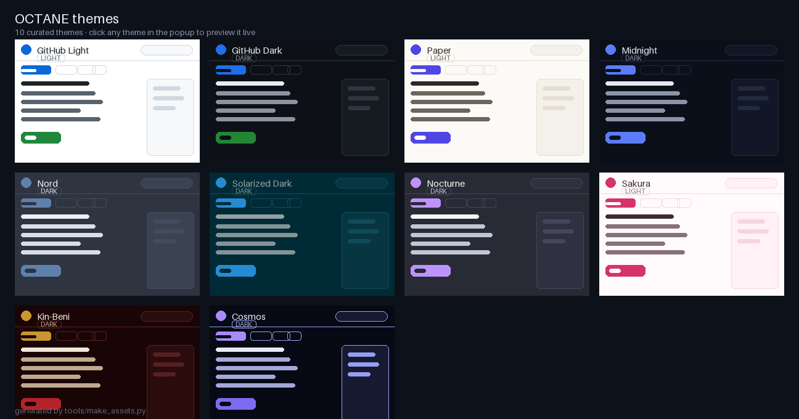

# 🎨 OCTANE — Themes & Zen for GitHub


> Restyle GitHub with beautiful themes, custom backgrounds and your **own**
> color schemes — then declutter the interface so it finally makes sense to
> newcomers.

A tiny, dependency-free browser extension (Manifest V3) that re-themes
[GitHub](https://github.com) on the fly — and this time you're not limited to
*light* and *dark*.



> **Want to see it right now?** Open [`docs/demo.html`](docs/demo.html) — a
> fully self-contained live preview (also nice for hosting on GitHub Pages).

---

## ✨ Features

### 1. Ten one-click themes (no page reloads)
GitHub ships *one* light theme and *one* dark theme. OCTANE ships **ten**,
applied instantly to every open GitHub tab and persisted across restarts:

| Theme | Vibe | Mode |
| --- | --- | --- |
| GitHub Light | The default, for when you want stock | Light |
| GitHub Dark | GitHub's native dark, as a baseline | Dark |
| **Paper** | Warm, soft off-white with indigo accents | Light |
| **Midnight** | Deep navy with electric blue | Dark |
| **Nord** | The beloved arctic palette | Dark |
| **Solarized Dark** | Ethan Schoonover's classic | Dark |
| **Nocturne** | Purple-pink "Dracula-flavored" | Dark |
| **Sakura** | Soft pink pastel — with falling petals 🌸 | Light |
| **Kin-Beni** 🆕 | Japanese vermilion red & gold on sumi black — with embers | Dark |
| **Cosmos** 🆕 | Hollow, glassy deep space — with twinkling stars ✨ | Dark |

### 2. Your own accent color
Don't like a theme's accent? Pick any color and it overrides links and
primary buttons across **every** preset theme — with automatically computed
contrast so text stays readable.

### 3. Custom backgrounds 🆕
Put a wallpaper behind your GitHub content:

- **Image** — upload your own (auto-compressed & saved locally) or paste a URL
- **Gradient** — two colors + angle, or one of six presets (including a
  red & gold "Kin-Beni")
- **Solid color** — flat color of your choice
- **Fade slider** — how much the wallpaper shows through, so text never
  becomes unreadable

GitHub's cards stay solid; the wallpaper glows around and behind them.

### 4. Build any color scheme you want 🆕
The **Custom** tab is a full theme builder: pick a light or dark base, then
set **page background, cards, text, muted text, borders, accent, primary
button and header** — anything you don't touch is derived automatically.
This is the "no more feature requests" feature: if you can think of a color
scheme, you can make it.

The Custom tab also has a **"Hide horizontal scrollbars"** toggle — it
removes the sideways scrollbar in code blocks and tables (content still
scrolls with a trackpad or Shift + wheel).

### 5. "Simplify" mode for newcomers — Signal vs Context vs Noise
Built on a simple philosophy: **Signal** (code, files, issues, PRs) always
stays. **Context** (languages, contributors, stars) gets dimmed. **Noise**
(promos, popularity, discovery) gets removed.

| Level | What it does |
| --- | --- |
| **Gentle** | Quieter GitHub — hides promos, Releases, Packages & Deployments; dims stars, forks and sidebar metadata |
| **Focus** | A coding workspace — hides social & popularity metrics, discovery links and the last-commit row; keeps Code, files, the README and the About box (your profile picture stays) |

**Focus extras:** a small pill shows "N elements hidden" (click it to exit),
and **Ctrl/Cmd + Shift + F** toggles Focus from anywhere.

### 6. Ambient theme effects
Sakura sheds **falling petals**, Cosmos has a **twinkling starfield**, and
Nocturne & Kin-Beni glow with **rising embers** — a lightweight canvas that
pauses when the tab is hidden. Toggleable in the popup.

### 7. Glassy navbar
Turn a background on and the top navigation becomes frosted glass
(backdrop-blur + translucency), so the whole page feels like one continuous
surface.

### 8. New-user tips banner
An optional friendly bar on repository pages:

> **Code** is the project's files · the **README** explains what it does ·
> **Star** saves it to your list, **Fork** copies it to your account.

### 9. Built to survive GitHub's redesigns
Themes are expressed as GitHub's own CSS custom properties (with legacy
`--color-*` aliases mirrored automatically). All DOM work is text/attribute
based with multiple fallback selectors and wrapped in error guards, so a
GitHub layout change can never crash the extension — worst case, one rule
stops matching until the next release. SPA navigation (Turbo/pjax) is
handled, so themes, backgrounds and simplification re-apply as you click
around.

---

## 🚀 Install (developer mode, 30 seconds)

Works in **Chrome, Edge, Brave, Opera, Arc** and any Chromium browser.
(Firefox supports Manifest V3 too — same steps under `about:debugging`.)

1. **Download / clone** this repo
   ```bash
   git clone https://github.com/yourname/octane.git
   ```
2. Open `chrome://extensions` (Edge: `edge://extensions`, Brave: `brave://extensions`)
3. Toggle **Developer mode** on (top-right)
4. Click **Load unpacked** and select the `octane` folder
5. Open any GitHub repo, click the 🎨 icon in your toolbar, and make it yours

No build step. No dependencies.

---

## 🧭 Usage

- **Theme** — click a card; every open GitHub tab restyles instantly.
- **Accent** — use the picker or type a hex value; *Clear* falls back to the
  theme's own accent.
- **Background** — pick Image / Gradient / Color, then tune it; *Fade* keeps
  text readable.
- **Custom** — pick a base, tweak any colors, hit *Use this theme*.
- **Simplify** — *Off / Gentle / Focus*.
- **New-user tips** — toggle the "Quick start" bar.
- **Reset all** — back to defaults.

Settings sync via `chrome.storage.sync` (and your wallpaper via
`chrome.storage.local`), so they follow your browser profile across machines.

---

## 📁 Project structure

```
octane/
├── manifest.json          # MV3 manifest
├── shared/
│   └── themes.js          # Single source of truth: themes, custom builder, gradients
├── content/
│   └── content.js         # Injects theme + background CSS, simplification, tips
├── popup/
│   ├── popup.html         # Popup UI (Theme / Background / Custom tabs)
│   └── popup.js           # Popup logic (reads/writes storage)
├── icons/                 # Extension icons
├── docs/
│   ├── demo.html          # Self-contained live demo (host on GitHub Pages)
│   └── themes-preview.png # Theme preview image
├── tools/
│   ├── make_assets.py     # Regenerates icons + preview (Python + Pillow)
│   └── make_demo.py       # Rebuilds docs/demo.html from shared/themes.js
├── CHANGELOG.md
└── LICENSE                # MIT
```

---

## 🛣️ The whole process (from zero to published)

### A. Run it locally
Load the folder as an unpacked extension (see *Install* above). Make a
change → hit the ⟳ reload button on `chrome://extensions` → refresh GitHub.

### B. Add a theme in 60 seconds
Edit `shared/themes.js`, copy an existing theme object, change the `id`,
`name`, `base` and the colors. Done — the popup, content script, README
preview image and demo all pick it up. Then:

```bash
python3 tools/make_assets.py   # regenerate icons + themes-preview.png
python3 tools/make_demo.py     # regenerate docs/demo.html
```

### C. Publish on GitHub
```bash
cd octane
gh repo create octane --public --source=. --push
```
Enable **GitHub Pages** → set it to `main` / `docs` → share the
`docs/demo.html` live preview in your README.

### D. Publish to the Chrome Web Store
1. Zip the folder: `zip -r octane.zip octane -x "octane/.git/*"`
   (or grab the pre-built zip)
2. Go to the [Chrome Web Store Developer Dashboard](https://chrome.google.com/webstore/devconsole)
   → pay the one-time $5 registration
3. **Add new item** → upload the zip → fill in description/screenshots
   (use `docs/themes-preview.png`) → submit for review
4. Same zip works for Edge Add-ons and (with minor tweaks) Firefox AMO

### E. Grow it
A good README + live demo + a launch post ("I made GitHub themable — 9
themes, custom backgrounds, custom color schemes") is a reliable recipe for
stars. Keep themes expressed purely as CSS variables so they never break.

---

## 🛠️ Roadmap

- [ ] Per-repo theme overrides ("this repo always opens in Midnight")
- [ ] GitHub Enterprise / self-hosted instance support
- [ ] Font + code-font options (e.g. JetBrains Mono for the code view)
- [ ] "Zen mode" that hides the README chrome and shows only the file tree
- [ ] Published builds for Chrome Web Store & Firefox AMO
- [ ] Localization of the tips banner

---

## 🤝 Contributing

This is a tiny codebase and a great first open-source project to jump into.

1. Fork & clone, then load the folder as an unpacked extension.
2. Make your change — **no build step**, just reload the extension.
3. To add a theme: add an entry to `shared/themes.js`. That's it.
4. Open a PR with a screenshot.

Please keep themes expressed purely as CSS variables so they don't break when
GitHub ships UI changes.

---

## ⚖️ License

[MIT](LICENSE) — do whatever you want, just keep the copyright notice.

> **Disclaimer:** OCTANE is an independent community project and is not
> affiliated with, endorsed by, or sponsored by GitHub, Inc. "GitHub" and the
> Octocat are trademarks of GitHub, Inc.
